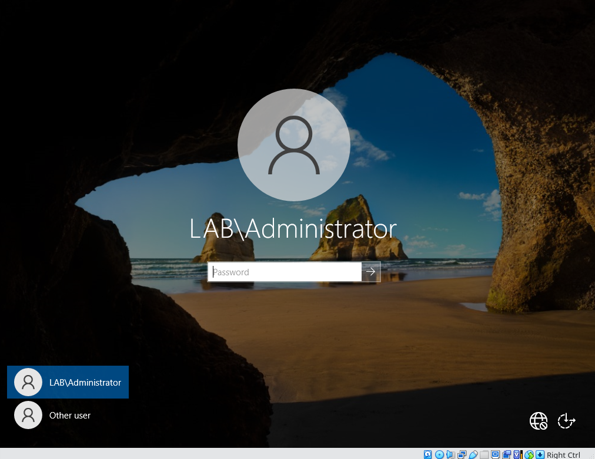
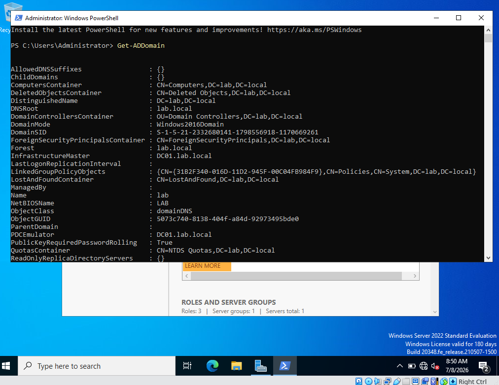

# Fase 1 — Active Directory On-Premises

## Objetivo
Montar um Domain Controller (DC01) com Windows Server 2022 em VirtualBox,
configurar Active Directory Domain Services, DNS e DHCP, e praticar
administração de utilizadores, grupos e GPOs.

## Ambiente
- Hipervisor: VirtualBox 7.x (host: Pop!_OS 22.04)
- VM: WSERVER (Windows Server 2022 Standard Evaluation, Desktop Experience)
- RAM: 4 GB | vCPU: 2 | Disco: 60 GB (VDI, dynamically allocated)
- Rede: NAT Network (LabNAT, 192.168.10.0/24)

## Passos realizados

### 1. Instalação do VirtualBox
Instalado via apt no Pop!_OS:
\`\`\`bash
sudo apt install virtualbox virtualbox-ext-pack
\`\`\`

### 2. Criação da VM e instalação do Windows Server 2022
- Criada VM com 4 GB RAM, 2 vCPUs, 60 GB disco
- ISO: Windows Server 2022 Evaluation (Microsoft Eval Center)

## Problemas encontrados

### Erro: "Windows cannot find the Microsoft Software License Terms"
**Sintoma:** ao arrancar a instalação, o setup falha com este erro logo no início.

**Diagnóstico:** o VirtualBox tinha gerado automaticamente um disco ótico
sintético do tipo "Unattended-xxxx" em vez de usar o ISO original montado,
visível em Settings → Storage.

**Solução:**
1. Removido o disco "Unattended-xxxx" em Settings → Storage
2. Adicionado manualmente o ficheiro .iso original do Windows Server 2022
3. Reiniciada a VM — instalação arrancou corretamente

**Causa raiz:** a funcionalidade "Unattended Installation" do VirtualBox
tentou automatizar o setup e gerou um disco de resposta corrompido/incompleto.

**Lição aprendida:** ao criar VMs no VirtualBox 7.x, confirmar sempre
em Settings → Storage se o disco ótico anexado é o ISO original,
e não um disco "Unattended" gerado automaticamente.

## Próximos passos
- [ ] Configurar IP estático no DC01
- [ ] Promover a Domain Controller (AD DS + DNS)
- [ ] Configurar DHCP
- [ ] Criar OUs e utilizadores de teste

## Configuração de rede e promoção a Domain Controller

- IP estático configurado: 192.168.10.10 /24, gateway 192.168.10.1, DNS 127.0.0.1
- Servidor renomeado para DC01
- Role AD DS instalada via PowerShell
- Promovido a Domain Controller da floresta `lab.local` (NetBIOS: LAB)

### Confirmação
Login já reflete o domínio (`LAB\Administrator`):

Output do `Get-ADDomain` confirma o domínio operacional:

- DomainMode: Windows2016Domain
- PDCEmulator: DC01.lab.local
- DNSRoot: lab.local
